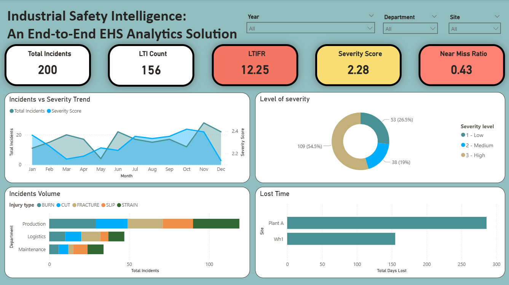

# EHS Safety Intelligence System
### Operational Risk Analytics for Manufacturing & Logistics

> **From reactive to predictive** — transforming fragmented safety records into an enterprise-grade risk intelligence platform using BigQuery and Power BI.

---

## The Problem

A mid-size manufacturing and logistics company is flying blind on safety:

| Question | Before | After |
|---|---|---|
| Which departments are driving incidents? | ❌ No visibility | ✅ Production leads all departments in volume, lost days, and High severity cases |
| Why do the same accidents keep repeating? | ❌ No root-cause tracking | ✅ Unsafe lifting and missing machine guards identified as top recurring causes |
| Are employees properly trained? | ❌ No compliance view | ✅ Training completion at 41% — 16 expired certificates, expiry wave forecast for Oct–Nov 2026 |
| Which site will fail the next audit? | ❌ No early warnings | ✅ Audit score at 84 vs 90 target — 120 non-compliances tracked with 78% follow-up rate |

Safety records lived in disconnected Excel files. Management only reacted **after** injuries occurred.

---

## Solution

A full EHS Business Intelligence pipeline — from raw messy data to executive-ready dashboards — built to shift the organisation from **reactive incident response** to **proactive risk prevention**.

```
Raw Excel Records
      │
      ▼
 BigQuery (Data Warehouse)
 ├── Data cleaning & standardisation
 ├── Date normalisation & severity scoring
 ├── Compliance flag generation
 └── Dimensional modelling (Employee, Site, Department)
      │
      ▼
 Analytics Layer
 ├── Risk & KPI aggregation tables
 └── Incident × Training × Audit relationships
      │
      ▼
 Power BI Dashboards
 ├── Executive Summary
 ├── EHS Manager View
 └── Plant Manager View
```

---

## Data Sources

Three source tables simulate real enterprise EHS data with intentional messiness — inconsistent date formats, missing severity values, duplicate records, and mismatched department names:

| Source | Description | Key Fields |
|---|---|---|
| `incidents.csv` | Workplace injury and near-miss logs | incident_id, incident_date, report_on, site_location, shift, department name, injury_type, severity, day_lost, root_cause, near_miss_flag, supervisor |
| `audits.csv` | Safety audit scores by site | audit_id, audit_date, department, site, auditor, score, non-compliance, status, follow up|
| `training.csv` | Employee training completion records | employee_id, department, site, training_type, completed, completion_date, expiry |

#### Before modeling, EDA was conducted to validate data quality and understand distributions.
---

## SQL Pipeline (BigQuery)

The SQL layer runs in two sequential files, each building on the previous:

### Stage 1 — Data Cleaning (`01_data_cleaning.sql`)
- Standardises date formats across all three tables
- Normalises severity labels (`HIGH`, `High`, `high` → `High`)
- Removes duplicate incident records
- Flags missing training completion dates

### Stage 2 — Dimensions (`02_dimensions.sql`)
- `dim_site` — site metadata with region and plant type
- `dim_department` — department hierarchy
- `dim_employee` — employee dimension with job role and tenure

> **Note:** KPI calculations (LTIFR, near-miss ratio, training compliance %, audit score trend) are implemented as DAX measures within Power BI rather than SQL, keeping business logic centralised in the reporting layer and separate from the data model.

---

## Key KPIs

The system tracks both **lagging** and **leading** safety indicators:

**Lagging (what already happened)**
- Total incidents by site and department
- Lost-Time Injuries (LTI) count
- Lost-Time Injury Frequency Rate (LTIFR)
- Average severity score

**Leading (early warning signals)**
- Near-miss rate by department
- Training compliance % by site
- Audit score trend (3-month rolling)
- Open non-compliance findings
- Follow-up closure rate

Monitoring leading indicators enables management to intervene **before** a near-miss becomes a recordable injury.

---

## Dashboard Preview



The Power BI report contains three pages:

**1. Incidents Overview** — Executive KPI scorecard showing Total Incidents (200), LTI Count (156), LTIFR (12.25), Severity Score (2.28), and Near Miss Ratio (0.43). Includes incidents vs severity trend by month, incident volume by department and injury type, severity level distribution, and total days lost by site.

**2. Incident Analysis** — Deep-dive into root causes (unsafe lifting, machine guard missing, wet floor, no PPE) and nature of injuries by type. Day-of-week analysis reveals Sunday as the highest-incident day. Severity by department shows Production carrying the heaviest burden of High severity lost days.

**3. Training & Audit Compliance** — Training completion rate (41%), training status breakdown (Valid / Expired / Expiring Soon), and a forward-looking expiry forecast through 2028. Audit performance shows average score of 84 against a 90-point target, with 120 total non-compliances, 78% follow-up rate, and a Score vs Non-Compliance scatter by department.

---

## Project Structure

```
ehs-safety-intelligence/
│
├── data/
│   ├── raw/                      # Original messy source files
│   └── processed/                # Cleaned outputs after BigQuery pipeline
│
├── eda/
│   ├── 01_incidents.sql          # Understand the raw incidents table before cleaning
│   ├── 02_audit.sql              # Understand the raw audit table before cleaning
│   ├── 03_training.sql           # Understand the raw training table before cleaning
│   └── 04_cross-table.sql
├── sql/
│   ├── 01_schema.sql             # Table definitions and data types
│   ├── 02_data_cleaning.sql      # Standardisation, deduplication, null handling
│   └── 03_dimensions.sql         # dim_site, dim_employee, dim_department, dim_date
│
├── power_bi/
│   ├── ehs_dashboard.pbix        # Full Power BI report file
│   ├── measures/                 # DAX measure documentation
│   │   └── kpi_measures.md       # All KPI formulas (LTIFR, compliance %, near-miss ratio)
│   └── dashboard_preview/        # Screenshot exports (3 pages)
│
├── reports/
│   └── ehs_findings_report.md    # Written analysis of key findings
│
└── README.md
```

---

## Key Findings

Analysis of incident, audit, and training data (2023–2026, with the majority of incidents occurring in 2025) surfaced four critical risk patterns:

- **Production is the highest-risk department across every dimension** — it leads in total incident volume, accumulates the most lost days (~280 at Plant A vs ~150 at Wh1), and carries the highest concentration of High severity cases. Unsafe lifting and missing machine guards are the top two root causes, both preventable through engineering controls and procedural enforcement.

- **LTIFR of 12.25 signals a systemic injury problem.** With 156 lost-time injuries out of 200 total incidents, 78% of all incidents resulted in lost time — an unusually high conversion rate pointing to a gap in early intervention. The near-miss ratio of 0.43 is critically low, suggesting near-misses are being underreported rather than genuinely rare, which masks the true risk exposure.

- **Sunday is the highest-incident day of the week** (~35 incidents), consistently outpacing all weekdays. This pattern points to fatigue from consecutive shifts, reduced supervision, or inadequate weekend handover protocols — a structural risk that scheduling and supervisor coverage changes could directly address.

- **Training compliance at 41% is driving the audit and compliance crisis.** With 16 already-expired certificates and 5 expiring soon, the expiry forecast shows a heavy wave peaking Oct–Nov 2026. The average audit score of 84 sits below the 90-point target with 120 open non-compliances — departments with the weakest training records are the same ones clustering at the highest non-compliance counts in the Score vs Non-Compliance analysis.

---

## What This Project Demonstrates

This project demonstrates:

- **Real-world data engineering** — handling messy, inconsistent EHS records the way they actually arrive from the field
- **Safety-critical KPI design** — building metrics that align with ISO 45001 and OSHA recordkeeping standards
- **Dimensional modelling for BI** — star schema design optimised for Power BI DAX queries
- **Executive communication** — translating operational data into decisions, not just dashboards
- **Domain depth** — understanding the difference between LTI, LTIFR, near-miss rates, and why each matters to a different stakeholder

---

## Relevant Industries

This architecture mirrors how EHS analytics is implemented in:
- Manufacturing & heavy industry
- Logistics and warehousing
- Oil & gas / energy
- Construction
- Any regulated industry under ISO 45001, OSHA, or RIDDOR

---

## Potential Extensions

- **Predictive risk scoring** — ML model to flag departments at elevated injury risk 30–60 days out, trained on audit trends and training gaps
- **Incident forecasting** — time-series model to anticipate high-risk periods (seasonal patterns, shift changes)
- **Cost of injury modelling** — estimate direct and indirect costs per incident type for financial reporting
- **Automated training alerts** — trigger notifications when compliance drops below threshold

---

## Tools & Stack

| Layer | Tool |
|---|---|
| Data warehouse | Google BigQuery |
| Data transformation | SQL (BigQuery dialect) |
| Visualisation | Microsoft Power BI |
| Source data format | CSV (simulated from Excel) |
| Documentation | Markdown |

---

## About This Project

Built as a portfolio project to demonstrate end-to-end analytics capability in a safety-critical domain. The data is synthetic but designed to reflect realistic patterns found in manufacturing EHS operations.

**Connect:** [LinkedIn](https://linkedin.com) | **Portfolio:** [GitHub](https://github.com/nawwarah-analyst)
